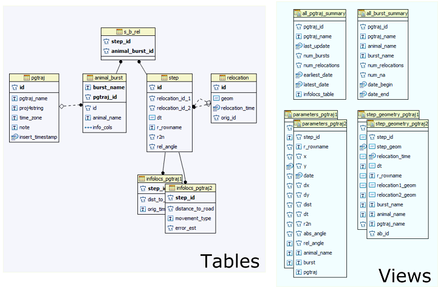

```{r setup, include=FALSE}
# Global options
library(knitr)
opts_chunk$set(fig.path="fig/")
```

## The pgtraj database model

### General remarks
This document describes the data model utilized for `pgtraj` as implemented in
`rpostgisLT`. There are five tables that make up the core data model:

- pgtraj
- animal_burst
- step
- relocation
- s_b_rel

The tables **pgtraj**, **animal_burst**, **step**, and **relocation** each
have a unique auto-incrementing integer identifier (primary key) column (**id**), which 
is referenced in other tables and views as the table name with an "_id" suffix 
(e.g., **pgtraj_id**). There are one of each of these tables in every pgtraj schema, 
which will store the core information that make up the trajectories. 
These tables are managed completely through `rpostgisLT` functions, and should not be manually altered.

Additional information about locations/steps in `pgtraj` data should be stored 
in an optional "infolocs" table, which is automatically created in `rpostgisLT`
functions (one for each pgtraj). See further information in the table description. 

The default schema name in `rpostgisLT` functions is **traj**, and can store as many pgtrajes as needed. For 
faster processing and retrieval, it is recommended to subdivide large datasets into
multiple pgtrajes, and to create different pgtraj schemas for different projects.
All functions default to schema **traj**, but the user can change the target schema, using 
the `schema` argument in all `rpostgisLT` functions.

There are two views that are created by default in every pgtraj schema:

- all_pgtraj_summary
- all_burst_summary

which provide important information about all pgtrajes and bursts currently stored in that pgtraj schema.

In addition, two views that are created for every pgtraj stored in the schema:

- parameters_(pgtraj_name)
- step_geometry_(pgtraj_name)

The first (*parameters_(pgtraj_name)*) calculates geometric parameters of each step in the 
trajectory, replicating the *adehabitatLT* **ltraj**. The *step_geometry_(pgtraj_name)* view creates (if applicable) 
PostGIS *geometry* linestring and points for the step and start and end point of the step, respectively.

### Database model



***animal_burst* table**\
Contains animal and burst names and their relation to pgtrajes.

| Name   | Type   | Constraint       | Description                          |
|--------|--------|------------------|--------------------------------------|
|id   | serial | PK               | Auto-generated numeric ID. |
|burst_name | text   | Not Null | Name of the burst.                  |
|animal_name | text   | Not Null | Name of the animal.                  |
|pgtraj_id | integer   | Not Null, FK | ID of pgtraj.                  |
|info_cols | text array |       | R data types of infolocs columns, stored to ensure consistency when re-imported into R. |

Table constraint: the combination of *burst_name* and *pgtraj_id* must be unique.

***pgtraj* table**\
Groups of trajectories, with unique names. The highest level in the pgtraj hierarchy; the PostgreSQL/PostGIS equivalent to the `ltraj` in `adehabitat`.

| Name    | Type   | Constraint       | Description                                      |
|---------|--------|------------------|--------------------------------------------------|
| id    | serial | PK               | Auto-generated numeric ID of pgtraj.             |
| pgtraj_name  | text   | Not Null, unique | Name or other identifier of trajectory group.    |
| proj4string  | text   |                  | Projection string of the ltraj, imported from R. |
| time_zone    | text   |                  | Time zone of the corresponding ltraj.            |
| note | text   |                  | Additional notes/comments about the ltraj              |
| insert_timestamp | timestamp with time zone |     | Time the pgtraj was inserted (or last updated) |

***relocation* table**\
Contains the geometry and time stamp of relocations.

| Name    | Type   | Constraint | Description                                          |
|---------|--------|------------|------------------------------------------------------|
| id    | serial | PK         | Auto-generated numeric ID.                |
| geom | geometry   |            | Geometry of the relocation. |
| relocation_time | timestamptz   |            | Time stamp of the relocation. |
| orig_id | integer |         | ID number from the original relocations table in the database |

***step* table**\
Steps and their relocations.

| Name      | Type        | Constraint    | Description                                                                                                           |
|-----------|-------------|---------------|-----------------------------------------------------------------------------------------------------------------------|
| id      | serial      | PK            | Auto-generated numeric ID of step. |
| relocation_id_1      | integer      | FK            | ID of the first relocation that form a step |
| relocation_id_2      | integer      | FK            | ID of the second relocation that form a step |
| dt        | interval    |  | Duration of the step.                                                                                                 |
| r_rowname | text        |  | Row name in the ltraj. This value is used for backward referencing between pgtraj and ltraj.                          |
| r2n      | float8      |             | R2n parameter copied from the ltraj on import from R. |
| rel_angle      | float8      |             | Rel.angle parameter copied from the ltraj on import from R. |

***s_b_rel* table**\
Relates step and burst, using the PKs of the *step* and *animal_burst* tables, respectively.

| Name | Type    | Constraint       | Description                              |
|------|---------|------------------|------------------------------------------|
| step_id | integer | PK, FK, Not Null | Pointing to the entry in step table.    |
| animal_burst_id | integer | PK, FK, Not Null | Pointing to the entry in animal_burst table.   |

There can also be one "infolocs" table for each pgtraj, if it is desirable to store additional
information with a pgtraj.

***infolocs_(pgtraj_name)* tables**\
Contain additional information on locations/steps for each pgtraj (optional).

| Name    | Type   | Constraint | Description                                          |
|---------|--------|------------|------------------------------------------------------|
| step_id    | integer | PK,FK         | ID number of the trajectory step (from step.id)               |
| ... | any |            | Additional columns as in the infolocs of an ltraj object |

### Storing geometries in PostGIS
PostGIS stores spatial data in either *geometry* or *geography* data types. The key difference between the two is that the *geometry* type is based on the Cartesian grid, while the *geography* type is based on the WGS 84 lon/lat SRID 4326 geodetic coordinate reference system (CRS)[^1]. In order to accurately calculate parameters in trajectories that span across large areas and have steps of tens of kilometers long, the earth cannot be considered in two dimensions, and the data must be appropriately projected. Hence the *geography* type seems to be the obvious choice to store the relocation and step geometries in the database. Unfortunately, as of PostGIS 2.2, only a limited selection of functions support the *geography* type[^2], and many of the *geometry-only* functions are used to calculate the step parameters. 

The R object class *ltraj* assumes that the coordinates stored in the object are projected and their projection is known. However, in many cases the projection is not known or ignored, therefore the data should be treated as unprojected. Because the *geography* type stores the data in the WGS 84 lon/lat CRS, this case cannot be handled and assuming the WGS 84 projection for each dataset would be clearly erroneous.

[^1]: Obe, R.O., Hsu, L.S., 2015. PostGIS in action, Second edition. ed. Manning, Shelter Island, NY.
[^2]: http://postgis.net/docs/PostGIS_Special_Functions_Index.html#PostGIS_TypeFunctionMatrix

### Managing projections in PostGIS and R
From `adehabitat` version 0.3.21 an *ltraj* object stores the projection of the relocations in
its *proj4string* attribute. The function `ltraj2pgtraj` tries to find the 
matching SRID (Spatial Reference Identifier) in the PostGIS database by using
`rpostgis::pgSRID`, and if found, uses the SRID for creating geometries. 
The *pgtraj* table stores the original *proj4string* so it can be
restored by `pgtraj2ltraj`.

### Managing time zones in PostgreSQL and R
In PostgreSQL all timezone-aware dates and times are stored internally in UTC.
For display they are converted to local time in the zone specified on the server. Therefore
the time zone of the input *ltraj* is stored in the *pgtraj* table's *time_zone*
field in order to restore the *ltraj* with the original time zone when using
`pgtraj2ltraj`.

This also means that if for some reason the user lives in The Hague (NL), has the dates in his ltraj in EST (e.g. "2003-05-31 17:00:56 EST"), puts the ltraj into the database, then for the same date they will see "2003-06-01 00:00:56" in the database, because the date is displayed in CEST (his local time zone), however internally it is stored in UTC.

**A note on managing time zones in R:**
Care must be taken when changing the time zone of a POSIXt object in R. 
Consider the following example:

```{r, eval=FALSE}
library(adehabitatLT)
data(ibexraw)
attr(ibexraw[[1]]$date, "tzone")
# [1] "Europe/Paris"
ibexraw[[1]][1, "date"]
# [1] "2003-06-01 00:00:56 CEST"
format(ibexraw[[1]][1, "date"], tz="America/Florida", usetz=TRUE)
# [1] "2003-05-31 22:00:56 America"
```

Notice that the time zone 'America/Florida' is **not valid**, as it is not in the
system's time zone database. Therefore the dates are assumed to be in the 
standard time zone (UTC) and no warning is given. To check the valid time
zone names in your system use `OlsonNames()`[^3].

[^3]: http://stat.ethz.ch/R-manual/R-devel/library/base/html/timezones.html

