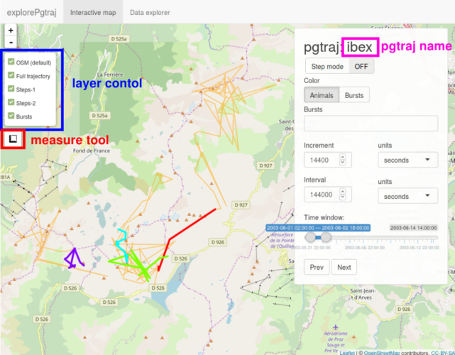

```{r setup, include=FALSE}
# Global options
library(knitr)
opts_chunk$set(fig.path="fig/")
```

**Note that in order to explore a pgtraj, all pgtrajes in the same traj schema need to have and SRID assinged to them.** Currently (v0.6.0) there is no function in `rpostgisLT` to assign an SRID to a pgtraj, thus you need to assign a projection to the `ltraj` and import that with `ltraj2pgtraj()`. When `explorePgtraj()` is launched, it checks whether the required materialized views exist in the provided schema and tries to create them if they don't, using the `createShinyViews()` function. The mention materialized views are `all_burst_summary_shiny` and `step_geometry_shiny_<pgtraj>`.

`explorePgtraj` can display three subsets of a trajectory, *the full trajectory*, *bursts* and *steps*. The *full trajectory* is always displayed in pale yellow and it is assigned to the *Full trajectory* layer in the *layer control*. The *bursts* of a trajectory are assigned to the *Bursts* layer and displayed with dashed line. You can select the bursts you want to display in the *Bursts* selection box. The display of *steps* are not assigned to any layer, they are always on. You can select which *steps* to display by adjusting the *Time window*. To step through a trajectory, use the *Prev* and *Next* buttons, or the left/right arrow keys. 

If you use the keys or buttons to explore a trajectory, you can set the amount of time increment in the *Increment* input box. Additionally, you can adjust the "width" of the *Time window* in the *Interval* input box.

The color of both the *bursts* and *steps* are governed by the *Color* switch. The colors are assigned either by the burst name or by the animal name. Note that the color scheme 


