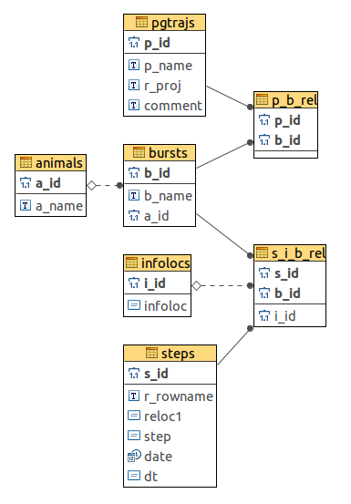

## Motivation for the package and its relation to adehabitatLT

Recent technological progress allowed ecologists to obtain a huge amount and diversity of animal movement data sets of increasing spatial and temporal resolution and size, together with complex associated information related to the environmental context, such as habitat types based on remote sensing, population density, weather. Most advanced movement data management now relies on the use of an integrated database system based on PostGIS, an extension of the open-source database management system PostgreSQL that adds support for spatial data.

Storing spatial objects in a PostGIS-enabled database is particularly useful for movement data (usually from wildlife collars/sensors), which are often very large, regularly updated, and require cleaning and manipulation prior to being used in research. On the other end of the process, the advancement of a movement ecology theoretical framework led to an unprecedented development of new analytical tools and methods, mostly available in the R statistical environment.

The package *rpostgisLT* focuses on streamlining the workflow for biologists storing/processing movement data in PostGIS and analyzing it in R, and aims at providing the tools to transparently benefit from the power of the most advanced database and statistical systems available for movement data.

The package [adehabitatLT](https://cran.r-project.org/web/packages/adehabitatLT/index.html) is a collection of tools for the analysis of animal movements. In particular, it builds on a dedicated class for animal movement data (*ltraj*), which abstracts movement to a set of trajectories and its geometrical descriptors. Then *rpostgisLT* streamlines location dataset processing into trajectories, including full integration with the R package *adehabitatLT* data type *ltraj*.

Although the [vignette of *adehabitatLT*](https://cran.r-project.org/web/packages/adehabitatLT/vignettes/adehabitatLT.pdf) defines a trajectory and its elements clearly, it is worth to repeat a few key concepts that are regularly used in this vignette. Thus a **trajectory** is a continuous curve described by an animal, person or object when it moves. If a trajectory is sampled with e.g. a GPS tracker, each measurement represent a **relocation**, while each two successive relocations form the start- and endpoint of a **step** respectively.

## The pgtraj database model

### General remarks
It is possible, but not recommended, to add extra columns to the tables to store
additional information. For example to preserve the old, non-integer burst IDs
additionally to the burst names (b_name), and also create new burst IDs (b_id),
the user might want to add a column to store the old burst IDs (e.g. b_old_id).
Note that although the columns *_id use auto-incrementing integers, it is
possible to provide own integer values for these columns. Also note that
additional information about the data can be provided in the infolocs tables,
which the the recommended procedure See further at the table description. 

The default schema name is ‘pgtraj’, and can store as many pgtrajes as needed.
Also there can be any number of pgtraj schemas to store pgtrajes. Therefore all
functions default to schema ‘pgtraj’, but the user can change the target schema.

It is possible to modify steps and bursts. The procedure in this case is to
create a new step or burst and delete the old one.

### Database model



**animals table**\
Contains animal names.

| Name   | Type   | Constraint       | Description                          |
|--------|--------|------------------|--------------------------------------|
|a_id   | serial | PK               | Auto-generated numeric ID of animal. |
|a_name | text   | Not Null, unique | Name of the animal.                  |

**bursts table**\
Contains burst information and their relation to animals. One burst can belong
only to one animal, but one animal can have many bursts.

| Name   | Type    | Constraint| Description|
|--------|---------|-----------------------------------------------------------------|-------------------------------------------------------------------------------|
| b_id   | serial  | PK | Auto-generated numeric ID of burst.| 
| b_name | text | default: animal name corresponding to the provided unique | Name or other identifier of burst.             |  
| a_id  | integer | FK| ID ofthe animal that made the burst. Pointing to the entry in animals table. |

**infolocs table**\
Contains additional information on steps. Mirrors the infolocs attribute of an ltraj object.

| Name    | Type   | Constraint | Description                                          |
|---------|--------|------------|------------------------------------------------------|
| i_id    | serial | PK         | Auto-generated numeric ID of infoloc.                |
| infoloc | json   |            | Contains the additional information encoded in JSON. |

**pgtrajs table**\
Groups of trajectories, with unique names. Groups can be defined on any criteria, e.g. steps belonging to one ltraj object can form a group, thus belong under one pgtraj.

| Name    | Type   | Constraint       | Description                                      |
|---------|--------|------------------|--------------------------------------------------|
| p_id    | serial | PK               | Auto-generated numeric ID of pgtraj.             |
| p_name  | text   | Not Null, unique | Name or other identifier of trajectory group.    |
| proj4string  | text   |                  | Projection string of the ltraj, imported from R. |
| ltraj_tz    | text   |                  | Time zone of the corresponding ltraj.            |
| comment | text   |                  |                                                  |

**p_b_rel table**\
Relates pgtraj and burst. The exact same burst (ID and name) can belong to many pgtrajs, as well as a pgtraj can contain many bursts.

| Name | Type    | Constraint       | Description                             |
|------|---------|------------------|-----------------------------------------|
| p_id | integer | PK, FK, Not Null | Pointing to the entry in pgtrajs table. |
| b_id | integer | PK, FK, Not Null | Pointing to the entry in bursts table.  |

**steps table**\
Steps and their first relocations.

| Name      | Type        | Constraint    | Description                                                                                                           |
|-----------|-------------|---------------|-----------------------------------------------------------------------------------------------------------------------|
| s_id      | serial      | PK            | Auto-generated numeric ID of step. Equal to the ID of the first of the two successive relocations that form the step. |
| r_rowname | text        | default: Null | Row name in the ltraj. This value is used for backward referencing between pgtraj and ltraj.                          |
| reloc1    | geometry    | default: Null | Geometry of the first relocation in a step. POINT                                                                     |
| step      | geometry    | default: Null | Geometry of the step. LINESTRING                                                                                      |
| date      | timestamptz | default: Null | Timestamp of the first of the two successive locations that form the step.                                            |
| dt        | interval    | default: Null | Duration of the step.                                                                                                 |

**s_i_b_rel table**\
Relates step, infoloc and burst. The exact same step (ID) can belong to many bursts, as well as a burst can contain many steps. One step–burst pair can relate to only one infoloc entry. So (step1, burst-A) relates to infoloc1, but it is possible that (step1, burst-B) relates to infoloc2.

| Name | Type    | Constraint       | Description                              |
|------|---------|------------------|------------------------------------------|
| s_id | integer | PK, FK, Not Null | Pointing to the entry in steps table.    |
| i_id | integer | FK, Not Null     | Pointing to the entry in infolocs table. |
| b_id | integer | PK, FK, Not Null | Pointing to the entry in bursts table.   |

### Storing geometries in PostGIS
PostGIS stores spatial data in either *geometry* or *geography* data types. The key difference between the two is that the *geometry* type is based on the Cartesian grid, while the *geography* type is based on the WGS 84 lon/lat SRID 4326 geodetic coordinate reference system (CRS) [^1]. In order to accurately calculate parameters in trajectories that span accross large areas and have steps of tens of kilometers long, the earth cannot be considered flat anymore and the data must be appropriately projected. Hence the *geography* type seems to be the obvious choice to store the relocation and step geometries in the database. Unfortunately, as of PostGIS 2.2, only a limited selection of functions support the *geography* type [^2], and many of the *geometry-only* functions are used to calculate the step parameters. 

The R object class *ltraj* assumes that the coordinates stored in the object are projected and their projection is known. However, in many cases the projection is not known or ignored, therefore the data should be treated as unprojected. Because the *geography* type stores the data in the WGS 84 lon/lat CRS, this case cannot be handled and assuming the WGS 84 projection for each dataset would be clearly erroneous.

[^1]: Obe, R.O., Hsu, L.S., 2015. PostGIS in action, Second edition. ed. Manning, Shelter Island, NY.
[^2]: http://postgis.net/docs/PostGIS_Special_Functions_Index.html#PostGIS_TypeFunctionMatrix

### Managing projections in PostGIS and R
Complete this section after the *ltraj* is updated by Clément.

### Managing time zones in PostgreSQL and R
In PostgreSQL all timezone-aware dates and times are stored internally in UTC.
They are converted to local time in the zone specified in the server. Therefore
the time zone of the input *ltraj* is stored in the *pgtrajs* table *ltraj_tz*
field in order to restore the *ltraj* with the original time zone when using
*pgtraj2ltraj()*.

**A note on managing time zones in R**
Care must be taken when changing the time zone of a POSIXt object in R. 
Consider the following example:

```{r, eval=FALSE}
library(adehabitatLT)
data(ibexraw)
attr(ibexraw[[1]]$date, "tzone")
# [1] "Europe/Paris"
ibexraw[[1]][1, "date"]
# [1] "2003-06-01 00:00:56 CEST"
format(ibexraw[[1]][1, "date"], tz="America/Florida", usetz=TRUE)
# [1] "2003-05-31 22:00:56 America"
```

Notice that the time zone 'America/Florida' is not valid, as it is not in the
system's time zone database. Therefore the dates are assumed to be in the 
standard time zone (UTC) and no warning is given. To check the valid time
zone names in your system use ```OlsonNames()```[^3].

[^3]: http://stat.ethz.ch/R-manual/R-devel/library/base/html/timezones.html

## Use cases
